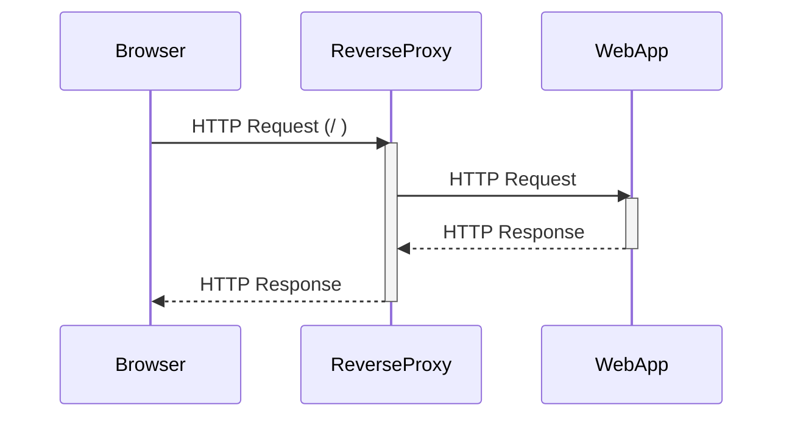
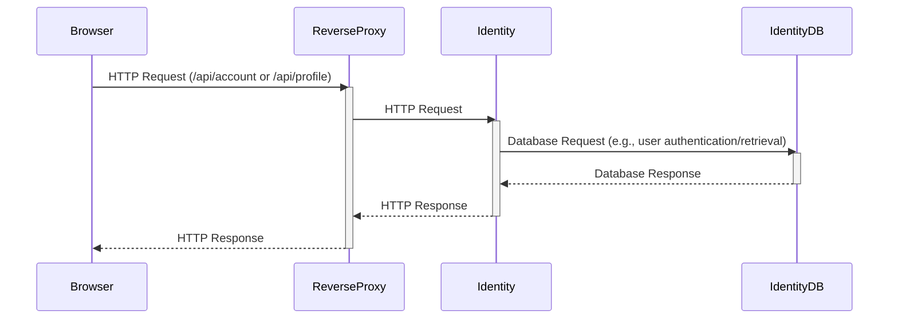
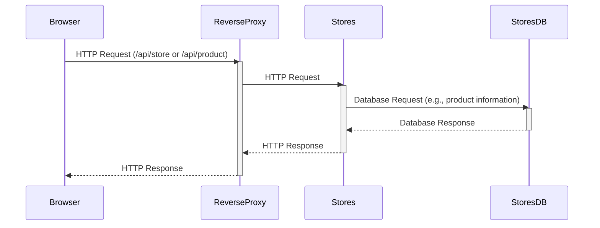
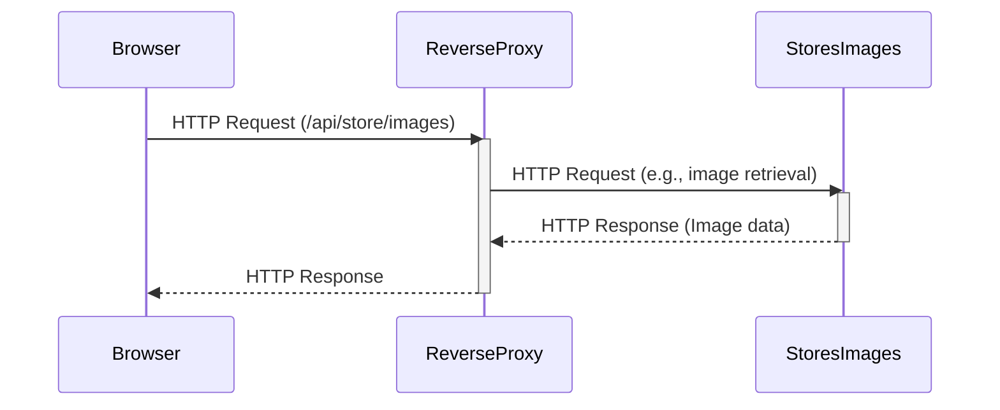
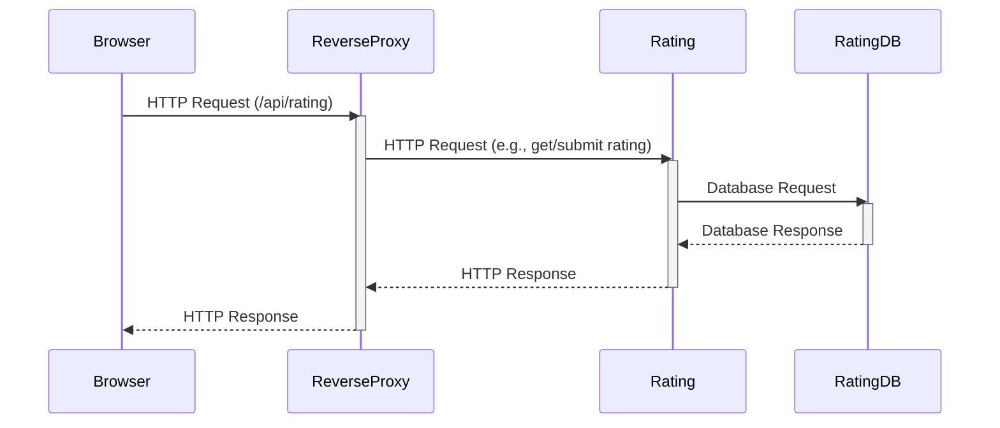
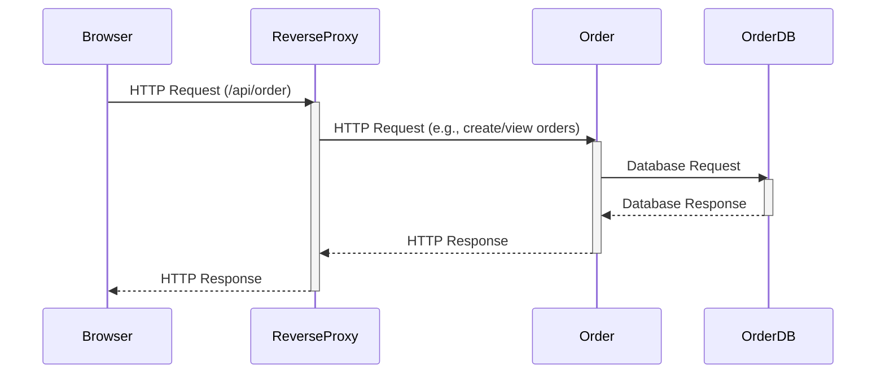

## Microservices Architecture Sequence Diagrams

This document outlines the sequence diagrams for the different services within
the microservices architecture, focusing on the interactions between the
services and their respective databases. The Reverse Proxy plays a central role
in routing requests to the appropriate services.

### 1. Web Application Service

This diagram shows the basic flow for serving the web application. The browser
requests the root path (`/`), which the Reverse Proxy forwards to the WebApp
service. The WebApp then returns the response, which is relayed back to the
browser through the Reverse Proxy.

### 2. Identity Service

The Identity service handles requests related to user accounts and profiles.
The Reverse Proxy directs requests starting with `/api/account` or
`/api/profile` to the Identity service. The Identity service typically
interacts with the IdentityDB (PostgreSQL) for data persistence.

### 3. Stores Service

The Stores service manages information related to stores and products. The
Reverse Proxy forwards requests beginning with `/api/store` or `/api/product`
to this service. The Stores service interacts with the StoresDB (MongoDB).

### 4. Stores Images Service

The Stores Images service serves static image content. Requests starting with
`/api/store/images` are handled by this service. Note that this service doesn't
interact with a database; it likely serves files directly from a designated
directory.

### 5. Rating Service

The Rating service handles requests for product ratings. The Reverse Proxy
routes requests starting with `/api/rating` to this service. The Rating service
uses the RatingDB (PostgreSQL) for data storage.

### 6. Order Service

The Order service manages order processing. Requests starting with `/api/order`
are directed to this service by the Reverse Proxy. The Order service persists
data in the OrderDB (MongoDB).

**Key Observations:**

- **Reverse Proxy as Central Point:** The Reverse Proxy acts as the single
  entry point for all external requests, routing them to the appropriate
  microservices based on the URL path.
- **Service Isolation:** Each microservice has its own dedicated database,
  promoting loose coupling and independent scaling.
- **Technology Diversity:** Different databases (PostgreSQL and MongoDB) are
  used based on the needs of each service.
- **Simplified Diagrams:** By breaking down the overall architecture into
  individual service diagrams, we can more clearly understand the interactions
  and dependencies within each service.

This documentation provides a clear and concise overview of the interactions between services in the provided architecture. The separate diagrams enhance readability and understanding of each service's role and dependencies.
