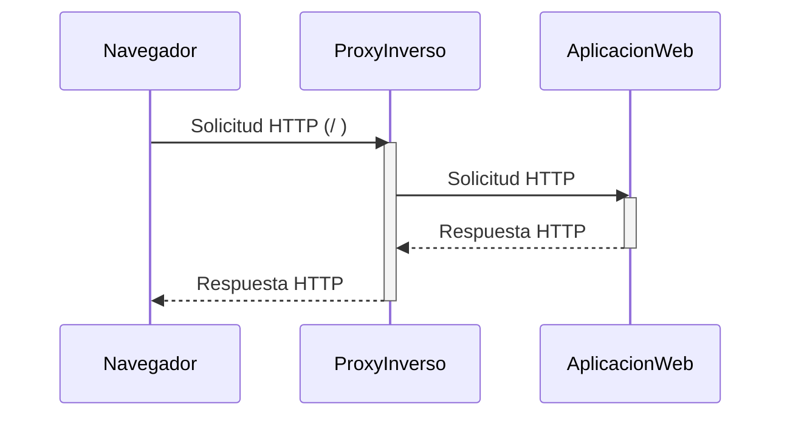
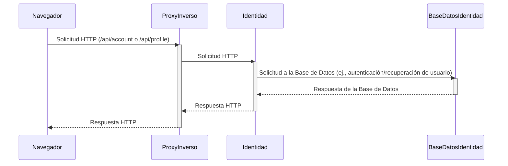
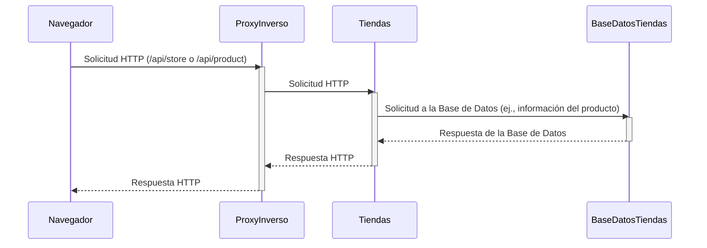
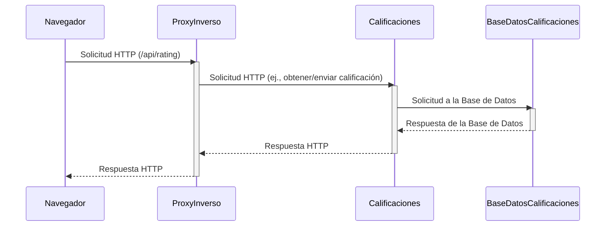
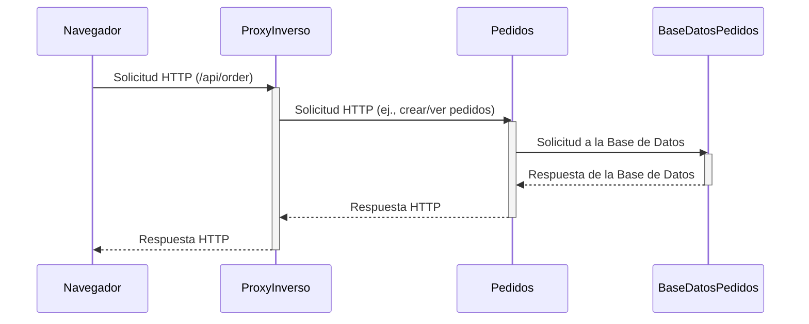
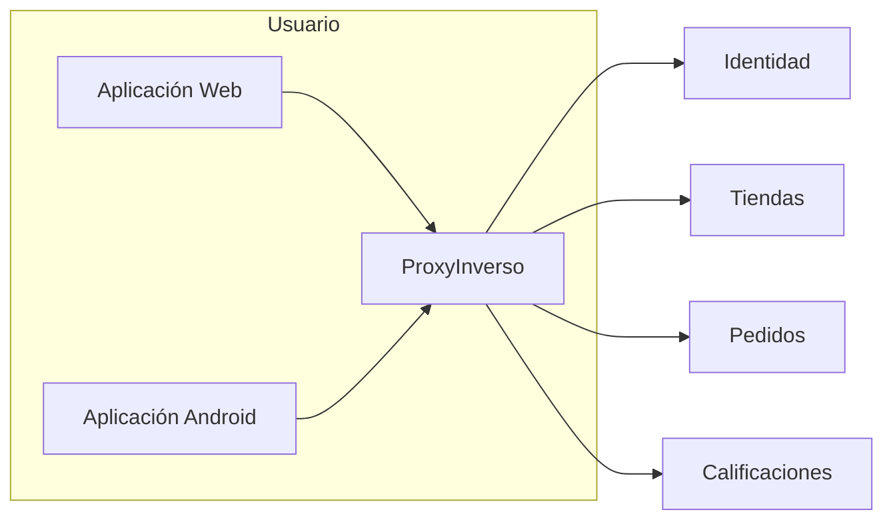

## Contexto y alcance.

El proyecto "Utal Eats" se centra en el desarrollo de una plataforma
simplificada para la simulación de pedidos de comida a domicilio. En esta etapa
inicial, el enfoque principal está en la experiencia del cliente y la
interacción con un conjunto predefinido de datos de restaurantes. **No se
incluye la gestión de restaurantes reales ni la interacción con sistemas
externos.**

**Aplicaciones Cliente:**

- **Aplicación Web y Móvil:** Permite a los clientes explorar un catálogo
  predefinido de restaurantes, simular la creación de pedidos y gestionar su
  cuenta.

**Servicios Backend (SOA):**

- **Servicio de Identidad (Identity):** Gestiona la autenticación de usuarios,
  registro y perfiles.
- **Servicio de Tiendas (Stores):** Proporciona información estática sobre un
  conjunto predefinido de restaurantes, incluyendo menús, ubicación e imágenes
  (no se gestionan datos en tiempo real).
- **Servicio de Pedidos (Orders):** Registra los pedidos simulados de los
  clientes (no se procesan pedidos reales).
- **Servicio de Calificaciones (Ratings):** Permite a los clientes calificar
  los restaurantes y dejar comentarios (estos datos no impactan en la operación
  real de ningún restaurante).

**Arquitectura:**

Se utiliza una arquitectura SOA, con un Reverse Proxy como punto
de entrada único. Esta arquitectura se implementa con fines educativos, para
familiarizarse con el desarrollo de sistemas distribuidos, aunque la escala del
proyecto no lo requiera estrictamente.

**Funcionalidades Clave para el Cliente:**

- **Registro e Inicio de Sesión:** Creación de cuentas de usuario y acceso a la
  plataforma.
- **Exploración de Restaurantes (Catálogo Estático):** Visualización de la
  información precargada de los restaurantes.
- **Simulación de Pedidos:** Agregar productos al carrito y simular el envío de
  un pedido (sin procesamiento real del pedido).
- **Historial de Pedidos Simulados:** Revisar los pedidos simulados
  anteriormente.
- **Calificación y Comentarios de Restaurantes (Simulados):** Proporcionar
  feedback simulado sobre los restaurantes.

**Fuera del Alcance:**

- **Interacción con Restaurantes Reales:** No existe conexión con restaurantes
  reales ni gestión de datos en tiempo real.
- **Procesamiento de Pagos:** No se incluye ningún sistema de pagos.
- **Gestión de Repartidores:** No se gestionan repartidores ni logística de
  entrega.

El proyecto es muy simpre y carece de muchas funcionalidades basicas para su real
funcionamiento, un ejemplo, es la falta de sesiones para el usuario, ya que,
la manera de hacerlo actualmente es muy insegura y extremadamente limitante.

## Diseño.

### Backend.

Este documento describe los diagramas de secuencia para los diferentes
servicios dentro de la arquitectura de servicios, enfocándose en las
interacciones entre los servicios y sus respectivas bases de datos. El Proxy
Inverso juega un papel central en el enrutamiento de las solicitudes a los
servicios apropiados.

#### 1. Servicio de Aplicación Web



Este diagrama muestra el flujo básico para servir la aplicación web. El
navegador solicita la ruta raíz (`/`), que el Proxy Inverso reenvía al servicio
AplicacionWeb. La AplicacionWeb luego devuelve la respuesta, que se retransmite
al navegador a través del Proxy Inverso.

#### 2. Servicio de Identidad (Identity)



El servicio de Identidad maneja las solicitudes relacionadas con las cuentas y
perfiles de usuario. El Proxy Inverso dirige las solicitudes que comienzan con
`/api/account` o `/api/profile` al servicio de Identidad. El servicio de
Identidad generalmente interactúa con la BaseDatosIdentidad (PostgreSQL) para
la persistencia de datos.

#### 3. Servicio de Tiendas (Stores)



El servicio de Tiendas gestiona la información relacionada con las tiendas y
los productos. El Proxy Inverso reenvía las solicitudes que comienzan con
`/api/store` o `/api/product` a este servicio. El servicio de Tiendas
interactúa con la BaseDatosTiendas (MongoDB).

#### 4. Servicio de Calificaciones (Ratings)



El servicio de Calificaciones maneja las solicitudes de calificaciones de
productos. El Proxy Inverso enruta las solicitudes que comienzan con
`/api/rating` a este servicio. El servicio de Calificaciones utiliza la
BaseDatosCalificaciones (PostgreSQL) para el almacenamiento de datos.

#### 5. Servicio de Pedidos (Orders)



El servicio de Pedidos gestiona el procesamiento de pedidos. Las solicitudes
que comienzan con `/api/order` son dirigidas a este servicio por el Proxy
Inverso. El servicio de Pedidos persiste los datos en la BaseDatosPedidos
(MongoDB).

**Explicación del rol del Reverse Proxy:**

Es crucial entender que todo el tráfico que el usuario final (ya sea desde la
aplicación web o la aplicación móvil de Android) pasa a través del Reverse
Proxy. Este actúa como un intermediario, recibiendo todas las solicitudes
entrantes y redirigiéndolas al servicio apropiado. De esta manera, el usuario
no interactúa directamente con los microservicios individuales, sino que el
Reverse Proxy funciona como un único punto de entrada.

Tanto la aplicación web como la aplicación móvil de Android envían sus
solicitudes HTTP al Reverse Proxy. Este, basándose en la ruta de la URL,
determina a qué microservicio debe enviar la solicitud. Por ejemplo:

- Si la solicitud es a `/api/account`, el Reverse Proxy la redirige al servicio
  de Identidad (Identity).
- Si la solicitud es a `/api/store`, el Reverse Proxy la redirige al servicio
  de Tiendas (Stores).
- Y así sucesivamente para los demás servicios.

El uso del Reverse Proxy ofrece varias ventajas, incluyendo:

- **Seguridad:** Oculta la arquitectura interna del sistema, protegiendo los
  microservicios de accesos directos no autorizados.
- **Balanceo de carga:** Puede distribuir el tráfico entre varias instancias de
  un mismo microservicio, mejorando el rendimiento y la disponibilidad.
- **Simplificación:** Facilita la gestión de SSL/TLS, la caché y otras
  funcionalidades transversales, sin necesidad de implementarlas en cada
  microservicio.



Este diagrama simplificado ilustra cómo tanto la aplicación web como la
aplicación de Android interactúan con el sistema a través del Reverse Proxy. El
proxy luego se encarga de enrutar las solicitudes a los servicios
correspondientes.

#### Uso de Docker y Docker-Compose

Para simplificar la ejecución y despliegue del sistema, se utiliza Docker y
Docker Compose. Esto permite contenerizar cada microservicio y sus dependencias
(bases de datos, etc.) en contenedores Docker independientes. De esta manera,
se garantiza la portabilidad del sistema y se evitan problemas de
compatibilidad entre diferentes entornos de desarrollo.

**Ventajas del uso de Docker:**

- **Aislamiento:** Cada servicio se ejecuta en su propio contenedor, lo que
  evita conflictos entre dependencias y facilita la gestión de diferentes
  versiones de software.
- **Portabilidad:** Los contenedores Docker pueden ejecutarse en cualquier
  sistema que tenga Docker instalado, simplificando el despliegue en diferentes
  entornos (desarrollo, pruebas, producción).
- **Reproducibilidad:** Docker Compose define la configuración del sistema en
  un archivo `docker-compose.yml`, lo que garantiza que el entorno se configure
  de la misma manera en cada ejecución.
- **Escalabilidad:** Facilita el escalado horizontal de los servicios,
  permitiendo ejecutar múltiples instancias de un mismo servicio en diferentes
  contenedores.

**Ejecución del sistema con Docker Compose:**

El archivo `docker-compose.yml` define todos los servicios del sistema,
incluyendo las aplicaciones cliente (web y móvil), los microservicios backend y
las bases de datos. Para ejecutar el sistema completo, basta con tener Docker
instalado y ejecutar el siguiente comando en la raíz del proyecto:

```bash
docker-compose up -d
```

Este comando descargará las imágenes necesarias, creará los contenedores y los
iniciará en segundo plano (`-d`). Una vez que los servicios estén en
funcionamiento, se puede acceder a la aplicación web a través del puerto
definido en el `docker-compose.yml`.

**Ejemplo de `docker-compose.yml` (simplificado):**

```yaml
services:
  web:
    build: ./web
    depends_on:
      - reverse-proxy
  reverse-proxy:
    image: nginx:latest
    ports:
      - "80:80"
    depends_on:
      - identity
      - stores
      - orders
      - ratings
  identity:
    build: ./identity
    depends_on:
      - identity-db
  identity-db:
    image: postgres:latest
    environment:
      - POSTGRES_USER=user
      - POSTGRES_PASSWORD=password
  # ... otros servicios y bases de datos
```

Gracias a Docker y Docker Compose, el despliegue y ejecución del sistema se
simplifica considerablemente, permitiendo a cualquier persona con Docker
instalado ejecutar el proyecto completo con un solo comando.

### Frontend.

#### Aplicación Web.

La aplicación web de Utal Eats es una interfaz de usuario interactiva creada con
astro. La aplicación web sigue la plantilla por defecto de astro, donde dentro
de la carpeta "src" se definen al menos 3 carpetas, la carpeta "components",
que contiene todos los componentes creados reutilizables para cada página, la
carpeta "Layout", que contiene un archivo con la plantilla para todas las
páginas, la carpeta "pages", que contiene cada una de las páginas necesarias
para la aplicación web, y se le agregó una carpeta styles que contiene un
archivo con el estilo que se le aplica al Layout, por ende se le aplica
globalmente a todas las páginas.

Para loguearse y registrarse se guarda el id de la cuenta del usuario en una
cookie, la cual es necesario que esté vigente para poder acceder a las páginas
de la aplicación web, si la cookie ya no se encuentra vigente, se redireccionará
al usuario a la página de log in.

Para el funcionamiento del carrito se utiliza el localStorage, guardando cada
item con su nombre, imagen, precio y cantidad.

Para obtener todos los datos de la aplicación web, como las categorías, tiendas,
ciudades, cuentas, productos, ordenes, ratings, se usan los servicios proporcionados
por el backend, dependiendo de cuando se ejecuta el código se debe hacer las
peticiones a distintas url, si el código se encuentra en el lado del cliente el url,
simplemente debe ser algo de este estilo "/api/account/login", sin embargo, si el
código se encuentra en el lado del servidor, el url debe reflejar las carpetas del
proyecto y se vería algo así "http://identity:3000/profile".


#### Aplicación Móvil.

La aplicación móvil de **Utal Eats** fue desarrollada utilizando **React Native**, **Expo**, y **TypeScript**, lo que permite una experiencia de usuario eficiente y multiplataforma en dispositivos **Android** y **iOS**. A continuación, se detallan sus características y componentes clave:


#### **Tecnologías Utilizadas**
1. **React Native**:
   - Base para el desarrollo de aplicaciones móviles nativas.
   - Permite la creación de componentes reutilizables y dinámicos.

2. **Expo**:
   - Simplifica el desarrollo mediante herramientas como:
     - Sistema de rutas basado en archivos para un manejo sencillo de la navegación.
     - Depuración y pruebas en tiempo real mediante su conexión con emuladores y dispositivos físicos.
     - Generación de archivos ejecutables como `.apk` sin configuraciones complejas.
   - Utilización del emulador de Android en **Android Studio** para pruebas y desarrollo.

3. **TypeScript**:
   - Mejora la calidad del código al detectar errores en tiempo de desarrollo.
   - Proporciona tipado estático, facilitando el mantenimiento y escalabilidad.


#### **Arquitectura SPA (Single Page Application)**
La aplicación móvil sigue el patrón de **SPA**, lo que significa:
- La navegación entre pantallas ocurre localmente, sin recargar la interfaz.
- La información se obtiene a través de solicitudes HTTP/HTTPS a las APIs.
- Los cambios en la interfaz se gestionan dinámicamente con React, proporcionando fluidez en la experiencia de usuario.


#### **Gestión de Autenticación**
1. **Inicio de Sesión y Registro**:
   - El sistema de login y registro está conectado al **servicio de identidad**, que se encarga de manejar toda la lógica de autenticación y gestión de usuarios.
   - Uso de **SecureStore** de Expo para almacenar de forma segura el `id` del usuario en el dispositivo.
   - Uso de **React Context** para compartir el `id` entre diferentes pantallas, evitando el problema de *prop drilling*.
   - Validación de entradas del usuario con **Zod**:
     - Verificación de contraseñas (formato y confirmación doble).
     - Mensajes de error claros (por ejemplo, correo duplicado).

2. **Flujo de Registro**:
   - Dividido en dos etapas para optimizar la experiencia del usuario.
   - Si el registro es exitoso, el **servicio de identidad** devuelve el `id` del usuario recién creado, el cual se guarda localmente. Posteriormente, el usuario es redirigido a la pantalla principal.

3. **Flujo de Login**:
   - Al iniciar sesión, el **servicio de identidad** valida las credenciales ingresadas y retorna el `id` del usuario. Este id se almacena localmente para mantener la sesión activa.


#### **Pantallas y Funcionalidades Principales**
#### **Página Principal**
- Muestra una lista de tiendas filtradas por la ciudad del usuario.
- Las tiendas se obtienen mediante una petición al **servicio de tiendas** y se renderizan con un componente **FlatList**:
  - Maneja grandes volúmenes de datos eficientemente.

#### **Página de Tienda**
- Al seleccionar una tienda, se accede a su página específica a través de rutas dinámicas (pasando el `id` como parámetro).
- Los productos de la tienda se obtienen mediante una petición al **servicio de tiendas**.

- Funciones clave:
  - **Carrito de Compras**:
    - Gestionado con **React Context**, lo que permite sincronización entre pantallas.
    - Permite agregar y eliminar productos.

#### **Página de Checkout**
- Muestra:
  - Detalle de los productos seleccionados.
  - Subtotales y el total de la compra.
- Para finalizar, el usuario puede dejar una **valoración** de la tienda o los productos:
  - Puntuación de 1 a 5 estrellas.
  - Comentarios opcionales enviados al **servicio de calificaciones** (`rating`).
- Los detalles de la compra se envían al **servicio de pedidos**, registrando la compra y almacenándola en el historial del usuario.

#### **Página de Perfil**
- Contiene:
  - Historial de órdenes pasadas, que se obtienen mediante una petición al **servicio de pedidos**.
  - Botón para editar datos del usuario, conectándose al **servicio de identidad**.
- Implementación con una barra de navegación tipo **Tab Bar**:
  - Acceso rápido al perfil y a la página principal.


#### **Beneficios del Desarrollo con Expo y React Native**
- **Eficiencia y Flexibilidad**:
  - Desarrollo rápido gracias a las herramientas de Expo.
  - Compatible con múltiples plataformas (iOS y Android) con un solo código base.
- **Rendimiento**:
  - Uso de componentes optimizados como `FlatList` para listas largas.
  - Almacenamiento seguro de datos locales con `SecureStore`.
- **Modularidad**:
  - Uso de Context API para una gestión limpia del estado global.

#### **Diseño Centrado en el Usuario**
- **Interfaz Intuitiva**:
   - Diseños consistentes en todas las pantallas, manteniendo un flujo lógico y claro desde el inicio de sesión hasta el checkout.
   - Navegación optimizada mediante **Tab Bar**, que permite acceder rápidamente a las funciones más importantes.

- **Accesibilidad**:
   - Diseño responsivo y adaptable para diferentes tamaños de pantalla.
   - Uso de colores y fuentes amigables para garantizar la legibilidad.

La combinación de estas tecnologías asegura una experiencia de usuario fluida y segura, cumpliendo con las necesidades tanto de los usuarios finales como del equipo de desarrollo.

## Definición de APIs.

Todos estos endpoints se encuentran bajo el prefijo `/api`.

### Servicio de Identidad (Identity)

- **POST /account/register:**

  - Descripción: Registra un nuevo usuario.
  - Parámetros (Cuerpo):
    - `email` (string, requerido): Correo electrónico del usuario.
    - `password` (string, requerido): Contraseña del usuario.
    - `name` (string, requerido): Nombre del usuario.
    - `phone` (string, requerido): Teléfono del usuario.
    - `address` (string, requerido): Dirección del usuario.
    - `city` (string, requerido): Ciudad del usuario.
  - Respuesta:
    - 201 (Created) con el ID del usuario creado en el cuerpo de la respuesta.
    - 400 (Bad Request) si el email ya está registrado.

- **POST /account/login:**

  - Descripción: Inicia sesión a un usuario existente.
  - Parámetros (Cuerpo):
    - `email` (string, requerido): Correo electrónico del usuario.
    - `password` (string, requerido): Contraseña del usuario.
  - Respuesta:
    - 200 (OK) con el ID del usuario en el cuerpo de la respuesta si las credenciales son válidas.
    - 401 (Unauthorized) si las credenciales son inválidas.

- **GET /profile:**
  - Descripción: Obtiene el perfil de un usuario.
  - Parámetros (Query):
    - `accountId` (number, requerido): ID del usuario.
  - Respuesta:
    - 200 (OK) con el objeto perfil en el cuerpo de la respuesta.
    - 404 (Not Found) si el perfil no existe.

### Servicio de Tiendas (Stores)

- **GET /store:**

  - Descripción: Obtiene una lista de tiendas en una ciudad específica.
  - Parámetros (Query):
    - `cityName` (string, requerido): Nombre de la ciudad.
  - Respuesta:
    - 200 (OK) con una lista de objetos tienda en el cuerpo de la respuesta. Cada objeto tienda incluye `storeId`, `storeName`, `imagePath`, `category` y `cityName`.

- **GET /product:**
  - Descripción: Obtiene una lista de productos de una tienda específica.
  - Parámetros (Query):
    - `storeId` (number, requerido): ID de la tienda.
  - Respuesta:
    - 200 (OK) con una lista de objetos producto en el cuerpo de la respuesta.
    - 404 (Not Found) si la tienda no existe.

### Servicio de Pedidos (Orders)

- **POST /order:**

  - Descripción: Crea un nuevo pedido.
  - Parámetros (Cuerpo):
    - `accountId` (number, requerido): ID del usuario que realiza el pedido.
    - `storeId` (number, requerido): ID de la tienda a la que se realiza el pedido.
    - `products` (array, requerido): Array de objetos producto. Cada objeto producto debe tener `product` (string), `quantity` (number) y `price` (number).
  - Respuesta:
    - 201 (Created) con un mensaje de confirmación y el `orderId` en el cuerpo de la respuesta.

- **GET /order:**
  - Descripción: Obtiene el historial de pedidos de un usuario.
  - Parámetros (Query):
    - `accountId` (number, requerido): ID del usuario.
  - Respuesta:
    - 200 (OK) con una lista de objetos pedido en el cuerpo de la respuesta.

### Servicio de Calificaciones (Ratings)

- **GET /rating:**

  - Descripción: Obtiene la calificación promedio y los comentarios de una tienda.
  - Parámetros (Query):
    - `storeId` (number, requerido): ID de la tienda.
  - Respuesta:
    - 200 (OK) con la calificación promedio y una lista de comentarios en el cuerpo de la respuesta.

- **POST /rating:**
  - Descripción: Envía una calificación para una tienda.
  - Parámetros (Cuerpo):
    - `storeId` (number, requerido): ID de la tienda.
    - `orderId` (string, requerido): ID del pedido.
    - `score` (number, requerido): Calificación numérica (0-5).
    - `comment` (string, opcional): Comentario del usuario.
  - Respuesta:
    - 201 (Created) si la calificación se registró correctamente.

## Preocupaciones.
